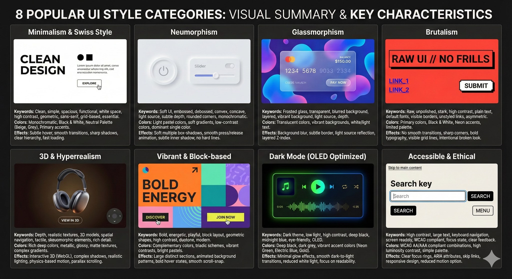

# Bảng Tổng Hợp Phong Cách Thiết Kế UI

[← Quay lại Trang chủ](./README.md)

**Nguồn**: [Viet Tran](https://www.facebook.com/share/p/1G7hbewhVu/)



Đây là bảng tổng hợp các phong cách thiết kế (Style Categories) phổ biến, cùng với các từ khóa (Keywords), gợi ý về màu sắc (Color Schemes) và hiệu ứng/tính năng (Effects/Features) đi kèm. Các từ khóa này được thiết kế để sử dụng trực tiếp trong System Prompts hoặc SKILLs cho các mô hình AI code.

| Style Category (Thể loại UI) | Keywords (Từ khóa) | Color Schemes (Màu sắc) | Effects/Features (Hiệu ứng/Tính năng) |
| --- | --- | --- | --- |
| **Minimalism & Swiss Style** | Clean, simple, spacious, functional, white space, high contrast, geometric, sans-serif, grid-based, essential. | Monochromatic, Black & White, Neutral Palette (Beige, Grey), Primary colors as accents. | Subtle hover effects, smooth transitions, sharp shadows (if any), clear typography hierarchy, fast loading. |
| **Neumorphism** | Soft UI, embossed, debossed, convex, concave, light source, subtle depth, rounded corners, monochromatic. | Light pastel colors, soft gradients, low-contrast colors, dominant single color with light/dark variations. | Soft box-shadows (multiple layers), smooth press/release animation, subtle inner shadow, no hard lines. |
| **Glassmorphism** | Frosted glass, transparent, blurred background, layered, vibrant background, light source, depth. | Translucent colors, vibrant background colors (blue, purple, pink), white/light text. | Background blur (backdrop-filter), subtle border, light source reflection, layered Z-index structure. |
| **Brutalism** | Raw, unpolished, stark, high contrast, plain text, default fonts, visible borders, unstyled links, asymmetric. | Primary colors (Red, Blue, Yellow), Black & White, Neon accents, limited palette. | No smooth transitions, sharp corners, bold typography, visible grid lines, large block elements, intentional "broken" look. |
| **3D & Hyperrealism** | Depth, realistic textures, 3D models, spatial navigation, tactile, skeuomorphic elements, rich detail. | Rich, deep colors, metallic, glossy, matte textures, complex gradients. | Interactive 3D elements (WebGL/Three.js), complex shadows, realistic lighting, physics-based motion, parallax scrolling. |
| **Vibrant & Block-based** | Bold, energetic, playful, block layout, geometric shapes, high color contrast, duotone, modern. | Complementary colors, triadic schemes, vibrant contrasts (e.g., Neon Green on Dark Blue), bright pastels. | Large, distinct sections, animated background patterns, bold hover states, smooth scroll-snap, large typography. |
| **Dark Mode (OLED Optimized)** | Dark theme, low light, high contrast, deep black, midnight blue, eye-friendly, OLED. | Deep black (#000000), dark grey (#121212), vibrant accent colors (Neon Green, Electric Blue, Gold) for highlights. | Minimal glow effects, smooth dark-to-light transitions, reduced white light emission, focus on readability. |
| **Accessible & Ethical** | High contrast, large text, keyboard navigation, screen reader friendly, WCAG compliant, focus state, clear feedback. | WCAG AA/AAA compliant color combinations, high luminosity contrast ratio, simple palette. | Clear focus rings, ARIA attributes, skip links, responsive design, reduced motion option. |
| **Claymorphism** | Soft 3D, chunky, playful, toy-like, bubbly, thick borders, double shadows, rounded edges. | Pastel colors, soft gradients, light background, dominant color with light/dark variations. | Inner and outer shadows (subtle), soft press/release animation, large, fluffy elements, no hard lines. |
| **Aurora UI** | Vibrant gradients, smooth blend, Northern Lights effect, mesh gradient, luminous, atmospheric, abstract background. | Complementary colors, vibrant colors (Blue, Purple, Pink, Teal), smooth color transitions. | Large, flowing background gradients (CSS/SVG), subtle animation of the gradient, depth effect via color layering. |
| **Retro-Futurism** | Vintage sci-fi, 80s aesthetic, neon glow, geometric patterns, CRT scanlines, pixel art, cyberpunk, vaporwave. | Neon colors (Electric Blue, Hot Pink, Cyan), deep black background, metallic silver/gold accents, duotone. | CRT screen effect (scanlines, distortion), neon glow text/borders, glitch effects, animated geometric patterns, monospace fonts. |

---

## Bảng Tiếng Việt

| Thể loại UI | Từ khóa | Màu sắc | Hiệu ứng/Tính năng |
| --- | --- | --- | --- |
| **Tối giản & Phong cách Thụy Sĩ** | Sạch sẽ, đơn giản, rộng rãi, chức năng, khoảng trắng, tương phản cao, hình học, sans-serif, dựa trên lưới, cần thiết. | Đơn sắc, Đen & Trắng, Bảng màu trung tính (Beige, Xám), Màu cơ bản làm điểm nhấn. | Hiệu ứng hover tinh tế, chuyển tiếp mượt mà, bóng sắc nét (nếu có), hệ thống phân cấp chữ rõ ràng, tải nhanh. |
| **Neumorphism** | UI mềm mại, nổi, lõm, lồi, lõm, nguồn sáng, độ sâu tinh tế, góc bo tròn, đơn sắc. | Màu pastel nhẹ, gradient mềm mại, màu tương phản thấp, màu đơn chủ đạo với biến thể sáng/tối. | Bóng hộp mềm (nhiều lớp), hoạt hình nhấn/thả mượt mà, bóng trong tinh tế, không có đường viền cứng. |
| **Glassmorphism** | Kính mờ, trong suốt, nền mờ, nhiều lớp, nền sống động, nguồn sáng, độ sâu. | Màu trong suốt, màu nền sống động (xanh dương, tím, hồng), văn bản trắng/sáng. | Làm mờ nền (backdrop-filter), viền tinh tế, phản chiếu nguồn sáng, cấu trúc Z-index nhiều lớp. |
| **Brutalism** | Thô, chưa hoàn thiện, rõ ràng, tương phản cao, văn bản thuần, phông mặc định, viền hiển thị, liên kết không kiểu, không đối xứng. | Màu cơ bản (Đỏ, Xanh dương, Vàng), Đen & Trắng, điểm nhấn Neon, bảng màu hạn chế. | Không có chuyển tiếp mượt, góc sắc, kiểu chữ đậm, đường lưới hiển thị, phần tử khối lớn, vẻ ngoài "gãy" có chủ ý. |
| **3D & Siêu thực** | Độ sâu, kết cấu thực tế, mô hình 3D, điều hướng không gian, xúc giác, phần tử skeuomorphic, chi tiết phong phú. | Màu sắc phong phú, sâu, kim loại, bóng, kết cấu mờ, gradient phức tạp. | Phần tử 3D tương tác (WebGL/Three.js), bóng phức tạp, ánh sáng thực tế, chuyển động dựa trên vật lý, cuộn parallax. |
| **Sống động & Dựa trên khối** | Đậm, năng động, vui tươi, bố cục khối, hình dạng hình học, tương phản màu cao, hai tông, hiện đại. | Màu bổ sung, bảng màu tam phân, tương phản sống động (ví dụ: Xanh lá Neon trên Nền xanh dương đậm), pastel sáng. | Các phần lớn, riêng biệt, hoa văn nền có hoạt hình, trạng thái hover đậm, cuộn mượt, kiểu chữ lớn. |
| **Chế độ tối (Tối ưu OLED)** | Giao diện tối, ánh sáng thấp, tương phản cao, đen sâu, xanh dương đêm, thân thiện mắt, OLED. | Đen sâu (#000000), xám đậm (#121212), màu nhấn sống động (Xanh lá Neon, Xanh dương Điện, Vàng) để làm nổi bật. | Hiệu ứng phát sáng tối thiểu, chuyển tiếp tối-sáng mượt mà, giảm phát xạ ánh sáng trắng, tập trung vào khả năng đọc. |
| **Tiếp cận & Đạo đức** | Tương phản cao, văn bản lớn, điều hướng bàn phím, thân thiện với trình đọc màn hình, tuân thủ WCAG, trạng thái focus, phản hồi rõ ràng. | Kết hợp màu tuân thủ WCAG AA/AAA, tỷ lệ tương phản độ sáng cao, bảng màu đơn giản. | Vòng focus rõ ràng, thuộc tính ARIA, liên kết bỏ qua, thiết kế đáp ứng, tùy chọn giảm chuyển động. |
| **Claymorphism** | 3D mềm, chunky, vui tươi, giống đồ chơi, bong bóng, viền dày, bóng kép, cạnh bo tròn. | Màu pastel, gradient mềm mại, nền sáng, màu chủ đạo với biến thể sáng/tối. | Bóng trong và ngoài (tinh tế), hoạt hình nhấn/thả mềm mại, phần tử lớn, mềm mại, không có đường cứng. |
| **Aurora UI** | Gradient sống động, pha trộn mượt mà, hiệu ứng Cực quang, gradient lưới, phát quang, khí quyển, nền trừu tượng. | Màu bổ sung, màu sống động (Xanh dương, Tím, Hồng, Xanh ngọc), chuyển tiếp màu mượt mà. | Gradient nền lớn, chảy (CSS/SVG), hoạt hình tinh tế của gradient, hiệu ứng độ sâu qua lớp màu. |
| **Retro-Futurism** | Khoa học viễn tưởng cổ điển, thẩm mỹ thập niên 80, phát sáng neon, hoa văn hình học, đường quét CRT, pixel art, cyberpunk, vaporwave. | Màu neon (Xanh dương Điện, Hồng Nóng, Xanh lơ), nền đen sâu, điểm nhấn bạc/vàng kim loại, hai tông. | Hiệu ứng màn hình CRT (đường quét, méo), phát sáng neon văn bản/viền, hiệu ứng glitch, hoa văn hình học có hoạt hình, phông monospace. |

---

## 📖 Hướng Dẫn Chọn Style UI Cho Anki Note Type Template

Hướng dẫn này giúp bạn sử dụng bảng trên để tạo thiết kế Anki note type template với các công cụ AI như ChatGPT, Claude, Gemini, Cursor, và các công cụ tương tự.

### 🎯 Bước 1: Xác Định Mục Đích & Đối Tượng

Trước khi chọn style, hãy tự hỏi:
- **Bạn đang học môn gì?** (Ngôn ngữ, Y học, Lịch sử, Toán học, v.v.)
- **Loại card bạn muốn tạo?** (Basic, Cloze, Vocabulary, Image Occlusion, v.v.)
- **Tông màu bạn muốn?** (Sáng cho học ban ngày, Tối để học đêm, Màu sắc sống động để ghi nhớ)
- **Bạn học ở đâu?** (Máy tính, Điện thoại, Tablet)

### 🎨 Bước 2: Chọn Style Phù Hợp

Dựa vào câu trả lời ở Bước 1, tham khảo bảng trên để chọn style:

| Nếu bạn muốn... | Chọn style này |
| --- | --- |
| Card đơn giản, dễ đọc, tập trung vào nội dung | **Minimalism & Swiss Style** |
| Card mềm mại, dễ chịu mắt, học lâu không mỏi | **Neumorphism** hoặc **Claymorphism** |
| Card đẹp mắt, sang trọng, tạo cảm hứng học tập | **Glassmorphism** |
| Card độc đáo, thu hút sự chú ý, khó quên | **Brutalism** hoặc **Retro-Futurism** |
| Card sống động, vui tươi, học từ vựng | **Vibrant & Block-based** hoặc **Aurora UI** |
| Card tối, học ban đêm, tiết kiệm pin | **Dark Mode (OLED Optimized)** |
| Card dễ đọc cho mọi người, font lớn | **Accessible & Ethical** |
| Card hiển thị hình ảnh 3D, học giải phẫu | **3D & Hyperrealism** |

### ✍️ Bước 3: Tạo Prompt Cho AI

Sau khi chọn style, copy các thông tin từ bảng và kết hợp vào prompt của bạn:

#### 📝 Cấu Trúc Prompt Mẫu:

```
Tôi muốn tạo Anki note type template cho [MÔN HỌC/LỌAI CARD] với phong cách [TÊN STYLE].

Style: [TÊN STYLE]
Keywords: [COPY TỪ KHÓA TỪ BẢNG]
Color Schemes: [COPY MÀU SẮC TỪ BẢNG]
Effects/Features: [COPY HIỆU ỨNG TỪ BẢNG]

Yêu cầu cụ thể cho Anki card:
- Loại card: [Basic, Cloze, Vocabulary, v.v.]
- Các trường: [Front, Back, Extra, v.v.]
- Màu sắc cụ thể nếu có
- Font chữ và kích thước
- Bố cục và khoảng cách
- Hiệu ứng khi hiển thị/flip card
```

#### 💡 Ví Dụ Prompt Thực Tế:

**Ví dụ 1: Tạo Card Học Từ Vựng với Minimalism & Swiss Style**

```
Tôi muốn tạo Anki note type template cho học từ vựng tiếng Anh với phong cách Minimalism & Swiss Style.

Style: Minimalism & Swiss Style
Keywords: Clean, simple, spacious, functional, white space, high contrast, geometric, sans-serif, grid-based, essential.
Color Schemes: Monochromatic, Black & White, Neutral Palette (Beige, Grey), Primary colors as accents.
Effects/Features: Subtle hover effects, smooth transitions, sharp shadows (if any), clear typography hierarchy, fast loading.

Yêu cầu cho Anki card:
- Loại card: Basic (Front/Back)
- Front: Hiển thị từ tiếng Anh, font lớn, rõ ràng
- Back: Hiển thị nghĩa tiếng Việt, phiên âm, ví dụ
- Màu nền: Trắng (#FFFFFF)
- Màu chữ: Đen (#000000)
- Màu accent: Xanh dương (#0066CC) cho phần quan trọng
- Font: Sans-serif, dễ đọc
- Khoảng cách giữa các phần tử rộng rãi
- Card phải hoạt động tốt trên Anki mobile và desktop
```

**Ví dụ 2: Tạo Card Học Đêm với Dark Mode (OLED Optimized)**

```
Tôi muốn tạo Anki note type template cho học y học với phong cách Dark Mode (OLED Optimized).

Style: Dark Mode (OLED Optimized)
Keywords: Dark theme, low light, high contrast, deep black, midnight blue, eye-friendly, OLED.
Color Schemes: Deep black (#000000), dark grey (#121212), vibrant accent colors (Neon Green, Electric Blue, Gold) for highlights.
Effects/Features: Minimal glow effects, smooth dark-to-light transitions, reduced white light emission, focus on readability.

Yêu cầu cho Anki card:
- Loại card: Basic với trường Extra
- Front: Câu hỏi y học, font lớn, màu sáng
- Back: Đáp án chi tiết với giải thích
- Extra: Thông tin bổ sung, hình ảnh minh họa
- Nền: Đen sâu (#000000)
- Chữ: Màu sáng (#FFFFFF)
- Màu nhấn: Xanh lá neon (#00FF88) cho keywords
- Font: Dễ đọc, kích thước lớn (18-20px cho mobile)
- Tối ưu cho học ban đêm, không hại mắt
```

**Ví dụ 3: Tạo Card Vocabulary với Glassmorphism**

```
Tôi muốn tạo Anki note type template cho học từ vựng ngoại ngữ với phong cách Glassmorphism.

Style: Glassmorphism
Keywords: Frosted glass, transparent, blurred background, layered, vibrant background, light source, depth.
Color Schemes: Translucent colors, vibrant background colors (blue, purple, pink), white/light text.
Effects/Features: Background blur (backdrop-filter), subtle border, light source reflection, layered Z-index structure.

Yêu cầu cho Anki card:
- Loại card: Vocabulary (Word, Meaning, Example, Image)
- Nền: Gradient xanh-tím với hiệu ứng làm mờ
- Card chính: Kính mờ trong suốt, có border nhẹ
- Word: Hiển thị ở trên cùng, font lớn, đậm
- Meaning: Hiển thị trong khung kính mờ
- Example: Câu ví dụ với background trong suốt
- Image: Hiển thị hình ảnh minh họa
- Hiệu ứng flip mượt mà khi show answer
- Chữ màu trắng/sáng để nổi bật trên nền gradient
```

### 🎯 Bước 4: Điều Chỉnh & Tinh Chỉnh

Sau khi AI tạo ra template ban đầu:

1. **Kiểm tra màu sắc**: Đảm bảo màu sắc đúng như mô tả trong bảng, đặc biệt kiểm tra độ tương phản để dễ đọc
2. **Kiểm tra hiệu ứng**: Xác nhận các hiệu ứng đã được áp dụng, đảm bảo không làm chậm card
3. **Test trên Anki**: Import vào Anki và kiểm tra trên cả desktop và mobile
4. **Yêu cầu chỉnh sửa**: Nếu chưa đúng, hãy mô tả cụ thể những gì cần thay đổi

**Ví dụ yêu cầu chỉnh sửa:**
```
- Tăng khoảng trắng giữa từ và nghĩa
- Làm mờ nền mạnh hơn cho hiệu ứng glass
- Đổi màu accent từ xanh sang tím
- Font chữ lớn hơn cho dễ đọc trên mobile
- Giảm hiệu ứng để card load nhanh hơn
- Thêm khoảng cách cho phần ví dụ
```

### 💡 Mẹo & Lưu Ý

1. **Kết hợp nhiều style**: Bạn có thể kết hợp 2-3 style với nhau, ví dụ: "Minimalism với một chút Glassmorphism cho phần hiển thị nghĩa"

2. **Bắt đầu đơn giản**: Nếu mới bắt đầu, hãy chọn **Minimalism & Swiss Style** hoặc **Dark Mode** - dễ thực hiện, card load nhanh và kết quả thường tốt

3. **Sử dụng từ khóa tiếng Anh**: Các công cụ AI thường hiểu từ khóa tiếng Anh tốt hơn, nên copy từ bảng tiếng Anh

4. **Màu sắc cụ thể**: Nếu có màu yêu thích, hãy cung cấp mã màu hex (ví dụ: #FF5733) để AI hiểu chính xác

5. **Tối ưu cho mobile**: Anki thường được dùng trên điện thoại, nên luôn kiểm tra card trên mobile và yêu cầu font đủ lớn, khoảng cách đủ rộng

6. **Hiệu suất**: Tránh quá nhiều hiệu ứng phức tạp - card cần load nhanh để không làm gián đoạn việc học

7. **Accessibility**: Để học hiệu quả lâu dài, cân nhắc thêm yêu cầu về accessibility từ style **Accessible & Ethical** (font lớn, tương phản cao)

8. **Cấu trúc Anki**: Nhớ rằng Anki card có cấu trúc HTML/CSS, bạn cần chỉ rõ các trường (fields) như {{Front}}, {{Back}}, {{Extra}} trong prompt

9. **Flip animation**: Có thể yêu cầu hiệu ứng flip card mượt mà khi show/hide answer

### 📚 Tài Nguyên Hỗ Trợ

- **Xem hình ảnh minh họa**: Cuộn lên đầu trang để xem hình ảnh tổng hợp 8 phong cách UI phổ biến
- **Tham khảo bảng tiếng Việt**: Sử dụng bảng tiếng Việt để hiểu rõ hơn về từng style nếu chưa quen với thuật ngữ tiếng Anh
- **Thử nghiệm**: Đừng ngại thử nhiều style khác nhau cho cùng một dự án để tìm ra phong cách phù hợp nhất

### 🚀 Bắt Đầu Ngay

Chọn một style bạn thích từ bảng trên, copy các thông tin, và tạo prompt đầu tiên của bạn! Nhớ rằng thực hành nhiều sẽ giúp bạn quen thuộc với việc sử dụng các từ khóa này.

**Chúc bạn thành công với thiết kế UI của mình! 🎨**

---

[← Quay lại Trang chủ](./README.md)
